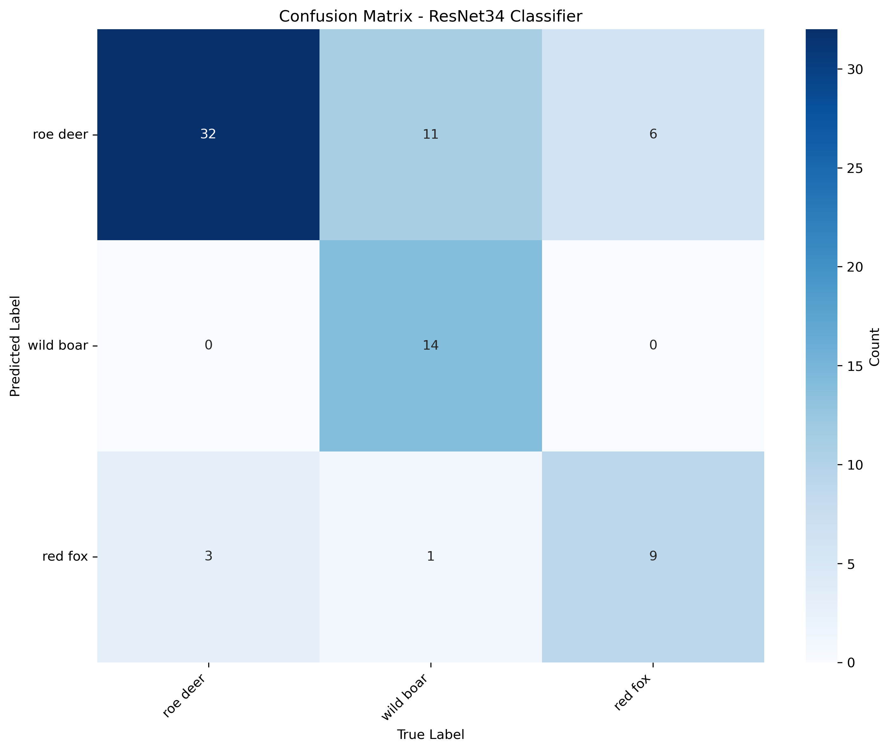
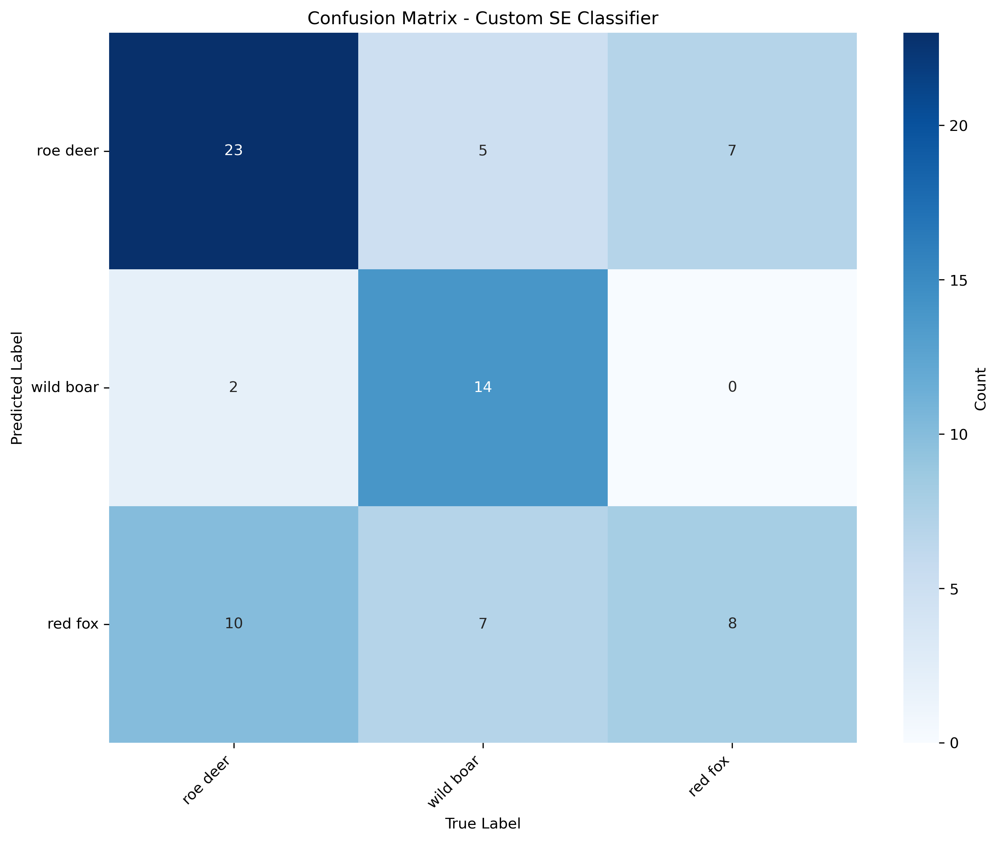

- [Wildlife Monitoring (Detection)](#wildlife-monitoring-detection)
  - [Data](#data)
  - [Methodologies](#methodologies)
    - [One-Step  Detection: Finetuning YOLOv11n and MegaDetector](#one-step--detection-finetuning-yolov11n-and-megadetector)
  - [Two-Step Detection](#two-step-detection)
    - [Finetuned ResNet34](#finetuned-resnet34)
    - [Custom Classifier](#custom-classifier)
  - [Conclusions](#conclusions)

# Wildlife Monitoring (Detection)

This is the repository for the final project of a course in Computer Vision for Industry and Environment from my Master's Degree.
It is centered around an image detection task, specifically focused on **wildlife monitoring.**

The goal was to analyze different DL methods for wildlife detection that can be used with small datasets, and compare their performance.

>### *Why wildlife detection?*
>The conservation of wildlife, and monitoring of protected natural areas, is becoming increasingly important, given the impact of climate change and the increasnig rate at which certain species are becoming endangered.
>
> Deep Learning-powered image detection can complement the monitoring capabilities of trap cameras, to allow for faster and more precise analysis of the behaviour, dynamics and population distribution of animal species. These automated tools can help biologists and experts in assessing important aspects of wildlife, and possibly act based on the resulting insights.

## Data

The dataset considered was a subset of [the MOF and BNP datasets](https://data.uni-marburg.de/entities/dataset/eafc2547-4616-48a4-b9ee-cd28f207afba) (licensed under [Creative Commons Attribution 4.0](https://creativecommons.org/licenses/by/4.0/)), which consist of a total of ~17500 camera trap images, recorded in the Marburg Open Forest in Hesse, Germany and  Podlaskie Voivodeship, Poland [^1]
([Schneider et al., 2024](https://ietresearch.onlinelibrary.wiley.com/doi/epdf/10.1049/cvi2.12294)).

In particular, I worked on a small subset of the datasets, by applying manual labeling to 305 images of the MOF dataset selected for train, and to 70 images taken from the BNP dataset (and the "Empty" directory of the MOF dataset, with non-detected images) for validation/testing. For the manual labelling I used the [YoloLabel](https://github.com/developer0hye/Yolo_Label?tab=readme-ov-file) tool.

The species of animals considered, given the small dimension of the dataset, were simply three, chosen from common European medium-large mammals: 
- Roe Deer (*Capreolus Capreolus*): 109 images included in the training set
- Wild Boar (*Sus Scrofa*): 104 images included in the training set 
- Red Fox (*Vulpes Vulpes*): 87 images included in the trianing set

[To avoid the training of models that would always detect bounding boxes, also 5 no-animals images were included in the training set.]

## Methodologies

The approach I used can be split into four different methodologies, to be compared:
1. Fine-tune a YOLO object detection model (specifically, [YOLOv11n](https://docs.ultralytics.com/models/yolo11/#performance-metrics)) for a direct animal detection + classification in one step.
2. Analogously to approach 1., but by fine-tuning a [MegaDetector](https://github.com/agentmorris/MegaDetector?tab=readme-ov-file#whats-megadetector-all-about) model (specifically, [MDv1000](https://github.com/agentmorris/MegaDetector/blob/main/docs/release-notes/mdv1000-release.md)), which is a SOTA model for animal detection, to also perform species classification in one step.
3. Apply a two-step detection, by using a pretrained MDv1000 to perform animal detection, and finetune [ResNet34](https://docs.pytorch.org/vision/main/models/generated/torchvision.models.resnet34.html) to be run on the resulting crops
4. Apply a two-step detection approach, analogous to 2., but training from scratch a custom classifier (based on [Squeeze-and-Excitation Blocks](https://openaccess.thecvf.com/content_cvpr_2018/papers/Hu_Squeeze-and-Excitation_Networks_CVPR_2018_paper.pdf)) to run on the resulting detected animals.

### One-Step  Detection: Finetuning YOLOv11n and MegaDetector

The one-step detection YOLOv11n model was finetuned by:
- Freezing its first 10 layers (the feature extracting backbone)
- Giving larger weights to the classification and [Distribution Focal Loss](https://arxiv.org/pdf/2006.04388) functions, to get more precise classification performances and better predict the probability distribution of the target bounding boxes, focusing on difficult examples 
- Applying data augmentation to reduce overfitting and improve generalization, namely:
    - *Random horizontal flipping*
    - *Random vertical flipping*
    - *Random saturation change*
    - *Random brightness change*
    - [Albumentations](https://albumentations.ai/) data augmentations (*[blur](https://docs.ultralytics.com/integrations/albumentations/#blur), [median blur](https://docs.ultralytics.com/integrations/albumentations/#median-blur), [grayscale conversion](https://docs.ultralytics.com/integrations/albumentations/#grayscale), [CLAHE](https://docs.ultralytics.com/integrations/albumentations/#contrast-limited-adaptive-histogram-equalization-clahe)*), applied automatically during training with the [Ultralytics API integration](https://docs.ultralytics.com/integrations/albumentations/#how-to-use-albumentations-to-augment-data-for-yolo11-training).

The selected image size was 640x640 (as inidicated in YOLOv11n documentation), and the chosen batch size was of 16.

The performances of the fine-tuned YOLOv11n and MDv1000 on the one-step detection + classification task were comparable in accuracy, although with a different balance among the classes:

| Finetuned MDv1000                              | Finetuned YOLOv11n                               |
| ---------------------------------------------- | ------------------------------------------------ |
|  |  |

>*Normalized confusion marices for the finetuned MDv1000 (left) and YOLOv11n (right) models. The fine-tuned YOLOv11n shows a more balanced performance across the classes and an overall better one w.r.t. accuracy (although worse on roe deers).*

## Two-Step Detection 

For the two-step approach, I first tried finetuning YOLOv11n for the single-class animal detection part, to compare it to baseline MDv1000. Although performances were good, it still was definitely less precise and sensitive than MDv1000 (e.g., [mAP50-95](https://www.ultralytics.com/glossary/mean-average-precision-map) of 0.61 vs 0.72, and [bbox recall](https://docs.ultralytics.com/guides/yolo-performance-metrics/#how-to-calculate-metrics-for-yolo11-model) of 0.74 vs 0.83), so the latter was chosen as base detector.

The data to be used to train the classifier was simply extracted from the original images by cropping the ground truth bounding boxes and mapping them to the corresponding classes.

### Finetuned ResNet34

As first, powerful classifier model to fine-tune, I chose ResNet34 [^2], which although is not the SOTA image classifier anymore, still consistutes a good baseline for classification, and to compare a custom model against.
Also, the architecture is not excessively large, so it is possible to also train it on hardware with limited computational capabilities (as mine was).

The ResNet34 model was finetuned with the following configurations:
- Batch size: 16
- Initial convolutional features: 32
- Learning rate: 0.001
- Early stopping after no improvement on validation loss for 50 epochs, to avoid overfitting (given the more complex model and small dataset)
- Multiclass [Focal Loss](https://arxiv.org/pdf/1708.02002) with $\gamma = 2.0$ and class weights $\pmb{\alpha}$ set according to normalized inverse class frequency, to make the model focus more on difficult examples, and possibly migitgate the effects of the little imbalance in the classes

Crops were resized to (224, 224), to match with ResNet training data dimensions.
To make sure that the model conserved its initial feature extraction backbone, and not overfit too much on the new data, the weight of the first two "layers" (composed of a total of 7 basic blocks, and 14 convolutional layers) were frozen.

With this configuration, the model was able to reach 0.84 in accuracy and 0.85 in F1-score on the small validation set, with a lower - but still reasonably good - performance (0.74 in both accuracy and F1) on the external test dataset.

### Custom Classifier

For the architecture of the custom classifier, I chose to implement as basic building blocks the [Squeeze-and-Excitation modules](https://arxiv.org/pdf/1709.01507), in their version including residual connections.

This module allows to improve the performance of standard convolutional layers, by implementing a mechanism analogous to that of *attention*: 
1. First, the convolutional features are *squeezed*, by implementing global average pooling, obtaining a single, summarizing value for each channel ($F_{sq}$)
2. Then, the *excitation* operation is applied: two fully connected layers, with a nonlinear ReLu operation in between, are applied, to allow different channels to interact with each others. The results is then scaled with a sigmoid function to obtain some *weights*, representing the importance of each channel's information ($F_{ex}$)
3. The channels' information is *scaled* by the previously calculated weights ($F_{scale}$)

With this lightweight additional mechanism, SE blocks can be integrated in any convolutional architecture to provide consistent improvements.

>Summary of the operations performed inside a Squeeze-and-Excitation block. 
>Figure taken from the original SeNet paper [^3], page 2.

For this project, I chose to consider the residual version of SENet, implementing residual connections after two consecutive SE blocks.

>Schema of the original [ResNet](https://arxiv.org/pdf/1512.03385) residual connection module (left) and the combination of the residual module with the Squeeze-and-Excitation module (right). Figure taken from the original SeNet paper, page 4.

The model I built (the PyTorch code implementation can be found [here](/src/models/custom_classifier.py)) had the following configuration:
- Batch size: 16
- Initial convolutional features: 32
- Dropout rate (in final classification head): 0.3
- Same loss configuration (and parameters) of the ResNet34 model

After being trained for 300 epochs with a learning rate of 0.001, the model reach decent performances (0.75 accuracy and 0.71 F1-score on validation set, and 0.61 accuracy and 0.66 F1 on the external test set), although poorer - by 10% approximately - than the finetuned ResNet34. 

| Finetuned ResNet34                                 | Custom SE-based Classifier                     |
| -------------------------------------------------- | ---------------------------------------------- |
|  |  |

>*Confusion matrices for the finetuned ResNet34 (left) and custom classifier (right) models. It can be seen how ResNet34 has an overall better performance, but is not overwhelmingly superior - on wild boar and red foxes classes - to the custom model.*

## Conclusions

The field of animal detection has already some SOTA models (namely MegaDetector) for what concerns the localization part, but integrating the classification part - especially in difficult trap cameras dataset - is not trivial.

While one-step approaches seems to have a better performance, they are sometimes prone to inaccurate localization and false positives. 
For these reasons, alhough overall image contextual information can  be useful, it may be more effective and convenient to train better classifiers, applied to the more precise localizations provided by accurate models, to focus on the classification part, if needed. 

[^1]: Schneider, Daniel; Lindner, Kim; Vogelbacher, Markus; Bellafkir, Hicham; Farwig, Nina; Freisleben, Bernd: Recognition of European mammals and birds in camera trap images using deep neural networks. IET Computer VIsion, 2024

[^2]: He, Kaiming; Zhang, Xiangyu; Ren, Shaoqing; Sun, Jian: Deep Residual Learning for Image Recognition, arXiv Preprint, 2015

[^3]: Hu, Jie; Li, Shen; Albanie, Samuel; Sun, Gang; Wu, Enhua: Squeeze-and-Excitation Networks. arXiv Preprint, 2019
